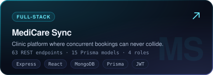
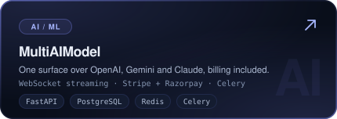
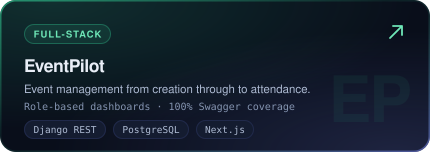
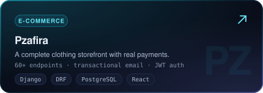

<!--
  Every panel below is generated by .github/workflows/profile.yml and committed
  into assets/ as a plain SVG. They are served by GitHub itself, so none of them
  can break when a third-party card service is paused or rate-limited.
  Regenerate locally with: node scripts/generate.mjs --preview
-->

  

  &nbsp;&nbsp;&nbsp;&nbsp;&nbsp;&nbsp;&nbsp;&nbsp;

---

### About

Computer Science undergraduate at **BRAC University** (CGPA **3.88/4.00**, SAAF Scholarship — 100% tuition waiver) and a full-stack engineer shipping production software across Python, TypeScript, FastAPI, Django and the MERN stack — healthcare platforms, AI products, event systems and e-commerce, usually several at once.

I care about the parts of software that only show up under load: the query that stops scaling, the race condition in a booking flow, the model that quietly overfits. Alongside that, my undergraduate thesis is applied deep-learning research in medical image segmentation.

- 👨‍🏫 Undergraduate Teaching Assistant at BRAC University, and Lead Software Engineer at **StackScholar**
- 🧪 Writing up **MatSeg-Conv**, a nested-capacity segmentation network that beats four established baselines while staying the smallest model benchmarked
- 🧩 **350+** algorithm problems solved across LeetCode, Codeforces and CodeChef
- 📫 Reach me at **abirhasanpiash@gmail.com**

---

### Activity

  
  

  

---

### Stack

  

---

### Selected work

  
  

  
  

→ **[The full catalogue, with architecture and trade-offs, is on my portfolio](https://ahpiashportfolio.vercel.app/projects)**

---

### Research

**Matryoshka Representation Learning for Medical Image Segmentation** — *Undergraduate thesis, Dept. of CSE, BRAC University*

MatSeg-Conv emits coarse, medium and fine segmentation masks from a single forward pass through nested 16/64/256-channel capacity bands, so one trained model serves every hardware budget instead of retraining a family of them.

| Mean Dice | Mean IoU | Parameters | Modalities |
| :---: | :---: | :---: | :---: |
| **0.8326** | **0.7488** | **29M** | **4** |

Beats U-Net, Attention U-Net, ResUNet and DeepLabV3+ (31M–39M parameters) on cross-dataset mean Dice while remaining the smallest model benchmarked — across brain MRI, colonoscopy, electron microscopy and dermoscopy. Up to **+0.16 Dice** over DeepLabV3+ on 50-image training subsets.

*Also:* **[Earthquake Magnitude & Significance Prediction](https://github.com/AbirHasanPiash/earthquake-prediction)** — an end-to-end pipeline over 3.4M seismic events reaching **R² = 0.83**.

---

### Writing

Long-form engineering pieces on the decisions teams keep having to make:

- [Why Your Team Should Adopt TypeScript](https://ahpiashportfolio.vercel.app/blog/why-typescript)
- [Django vs Flask vs FastAPI: which framework should AI/ML engineers learn?](https://ahpiashportfolio.vercel.app/blog/django-flask-fastapi-ai-ml)
- [From Models to Money: why AI/ML engineers must learn deployment & MLOps](https://ahpiashportfolio.vercel.app/blog/mlops-for-ai-ml-engineers)

→ **[All articles](https://ahpiashportfolio.vercel.app/blog)**

---

### Certifications

- **Introducing Generative AI with AWS** — Udacity, with AWS and Accenture, 2025 · [credential](https://www.udacity.com/certificate/e/6295e170-3d4f-11f0-9c7a-133a78634c1b)
- **Supervised Machine Learning: Regression and Classification** — Stanford University on Coursera, 2025 · [credential](https://coursera.org/share/81b969eac90af74da9d14c5a83420554)
- **CSE Fundamentals** — Phitron, 2024 · [credential](https://phitron.io/verification?validationNumber=PHBATCH562543111012)

---

  Open to software and AI engineering roles, freelance builds and research collaboration. 
  I reply to everything that isn't a template.

